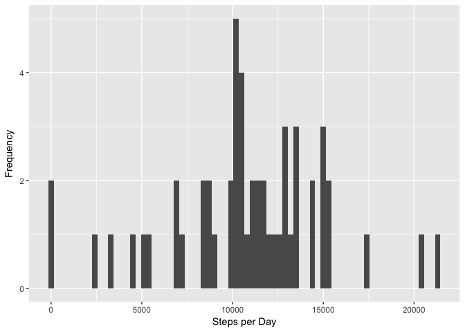
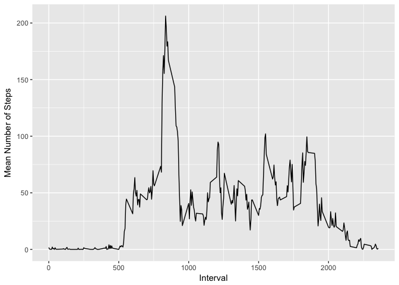
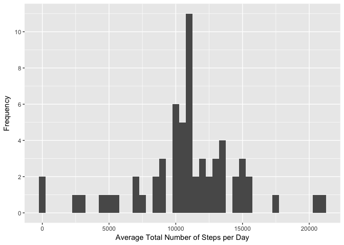
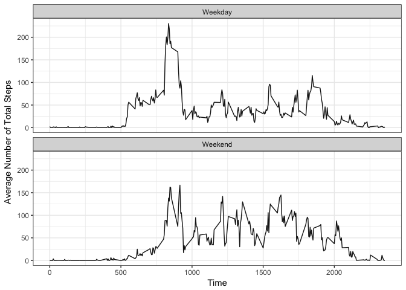

PA1
================
Tim Gossett
June 4, 2017

Week 4 Assignment - Activity monitoring data
--------------------------------------------

Required components: a Code for reading in the dataset and/or processing the data b Histogram of the total number of steps taken each day c Mean and median number of steps taken each day d Time series plot of the average number of steps taken e The 5-minute interval that, on average, contains the maximum number of steps f Code to describe and show a strategy for imputing missing data g Histogram of the total number of steps taken each day after missing values are imputed h Panel plot comparing the average number of steps taken per 5-minute interval across weekdays and weekends i All of the R code needed to reproduce the results (numbers, plots, etc.) in the report

Read in the data

``` r
activity <- read.csv("/Users/tgossett/activity.csv")
```

1. Calculate the number of steps in a day
=========================================

We can ignore the missing values so get rid of the NA's

``` r
#Calculate the number os steps in a day
steps_per_day <- aggregate(steps~date, activity, sum, na.rm=TRUE)

#Create a histrogram to show total number of steps per day

#plot a histogram of the steps taken per day
ggplot(data=steps_per_day, aes(x=steps)) + geom_histogram(binwidth=300) +
   scale_y_continuous(breaks=seq(0,14,2)) +
   labs(x="Steps per Day", y ="Frequency")
```



``` r
#Determine the Mean steps taken per day and report results
StepsPerDayMean<-mean(steps_per_day$steps)
StepsPerDayMean
#Determine the Median steps taken per day and report results
StepsPerDayMedian<-median(steps_per_day$steps)
StepsPerDayMedian
```

    ## [1] 10766.19
    ## [1] 10765

2. What is the daily daily activity pattern?
============================================

``` r
# Get the the average number of steps taken averaged across all days
stepsperinterval <- aggregate(steps~interval, activity,mean,na.rm=TRUE)
# Create a line plot the nubmer of steps taken averaged across all day
ggplot(stepsperinterval, aes(interval, steps)) + geom_line() + labs(x="Interval", y ="Mean Number of Steps") 
```



``` r
#Determine the maximum number os step taken on a five minute inteval and report
MaxStepsInterval <- stepsperinterval[which.max(stepsperinterval$steps),]$interval
MaxStepsInterval
```

    ## [1] 835

1.Calculate and report the total number of missing values in the dataset (i.e. the total number of rows with 𝙽𝙰s)
=================================================================================================================

``` r
#Figure out how many missing variables there and report that number
NumberofNAS <- sum(is.na(activity$steps))
NumberofNAS 

#Read the data in again with all the NAs
activity <- read.csv("/Users/tgossett/activity.csv")
activity$date<-as.Date(activity$date)

#Test each NA and replace it with the mean or if not NA replace with original value
activityNoNAS <- activity
for (i in 1:nrow(activityNoNAS)) {
  if (is.na(activityNoNAS$steps[i])) {
    interval_value <- activityNoNAS$interval[i]
    steps_value <- stepsperinterval[
      stepsperinterval$interval == interval_value,]
    activityNoNAS$steps[i] <- steps_value$steps
  }
}

#Find the number of steps a day with the new dataframe
New_steps_per_day <- aggregate(steps~date, activityNoNAS, sum, na.rm=TRUE)

#Determine the averagee number of steps per day with the new dataframe and report
newStepsPerDayMean<-mean(New_steps_per_day$steps)
newStepsPerDayMean

#Determine the median number of steps per day with the new dataframe and report
newStepsPerDayMedian<-median(New_steps_per_day$steps)
newStepsPerDayMedian


#Plot a histrogram of the average number of steps per day 
ggplot(data=New_steps_per_day , aes(x=steps)) + geom_histogram(binwidth=500) + scale_y_continuous(breaks=seq(0,12,2)) +labs(x="Average Total Number of Steps per Day", y ="Frequency")
```



    ## [1] 2304
    ## [1] 10766.19
    ## [1] 10766.19

With the new imputed dataframe the mean seems to stay the same but median now seems to have approached the mean since the missing variable were replaced by the average values.

Weekdays versus Weekends
========================

1.  Create a new factor variable in the dataset with two levels - "weekday" and "weekend" indicated wether a given date is a weekday or weekend day.
2.  Make a panel plot containing a time serives plot of the 5-minute interval and the average nubmer of steps taken, averaged across all weekday days or weekeend days.

``` r
#New factor is created for 'weekday' or 'weekend' based on the date
activityNoNAS<- mutate(activityNoNAS, date = ymd(date), weekday = wday(date), day.type = ifelse(weekday != 1 & weekday != 7,"Weekday", ifelse(weekday == 1 | weekday == 7, "Weekend", NA)))
#edit the dataframe to include the new factor
activityNoNAS <- mutate(activityNoNAS, day.type = as.factor(day.type))

#Agrgreate the steps now based whethere they were taken during weekdays or weekends
stepsintbydate <- aggregate(steps~day.type+interval, activityNoNAS, mean, na.rm=TRUE)

#plot the results for both Weekday steps and weekend steps
ggplot(stepsintbydate, aes(x=interval, y=steps)) + geom_line(color=rgb(.1,.1,.1)) + facet_wrap(~ day.type, nrow=2, ncol=1) +
        labs(x="Time", y="Average Number of Total Steps") +
        theme_bw()
```

 On weekdays there seems to be a high amount of steps early in the week and then the activity greatly falls off throughout the rest of the week compared to weekends.
